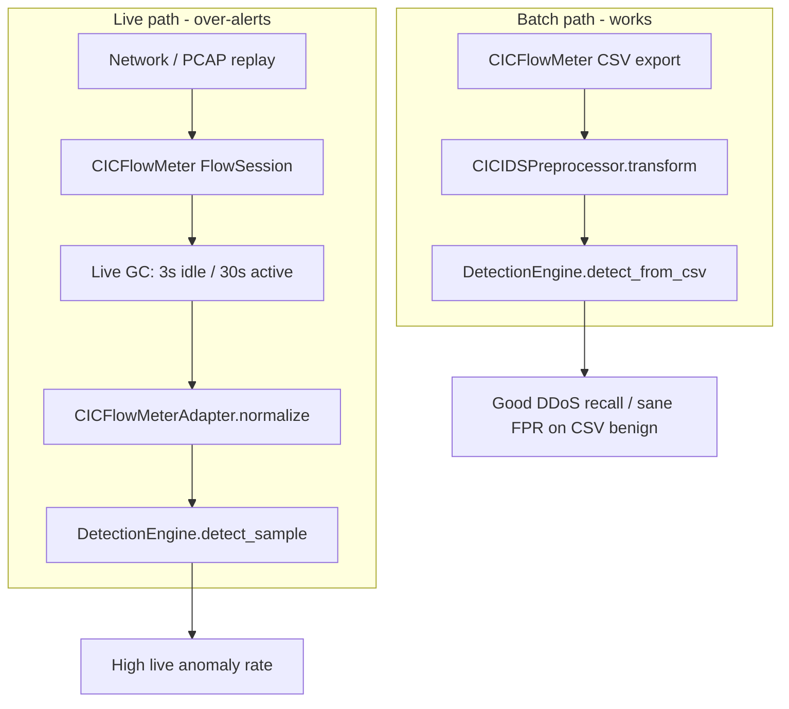
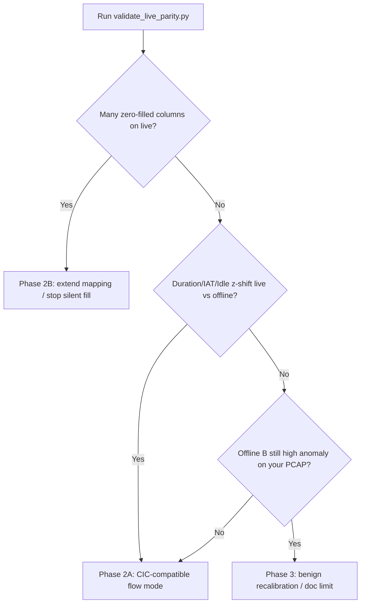

# Live capture false-positive fix plan

## Problem statement

**Symptom:** Live capture flags almost every flow; batch detection on CIC-IDS-2017 DDoS CSV looks reasonable.

**Working hypothesis (ordered):**

The detection engine is shared ([`app/core/detection.py`](app/core/detection.py) `detect_sample` vs `detect_from_csv`); the divergence is **how flows are segmented and featurized** before scoring.

**Known high-risk code (do not change until parity quantifies impact):**

| Risk | Location | Effect |
|------|----------|--------|
| Short live flow expiry | [`app/core/cicflow_bridge.py`](app/core/cicflow_bridge.py) `LIVE_FLOW_IDLE_TIMEOUT=3.0`, `LIVE_FLOW_MAX_ACTIVE_AGE=30.0` vs library ~240s idle / ~90s active | Distorts `Flow Duration`, IAT, idle/active, rates |
| Schema zero-fill | Adapter loops `feature_columns` → `0.0` + warning | Systematic PCA shift if many columns missing |
| Library ≠ official exporter | Documented in [`analysis/capture fix/cicflowmeter_clean_integration_plan.md`](analysis/capture fix/cicflowmeter_clean_integration_plan.md) | Residual mapping gaps |
| Domain shift | BENIGN-only training (often Monday lab traffic) vs your NIC | Elevated alert rate even with perfect features |

**Out of scope for the first fix pass (unless parity disproves capture causes):** retraining NSA, changing `target_fpr`, fusion weights, or Layer-2 heuristics.

---

## Phase 1 — Build the parity harness (diagnostics only)

Add a standalone script (planned name: [`validate and test/validate_live_parity.py`](validate and test/validate_live_parity.py)) plus a small markdown report output. No production router changes in this phase.

### 1.1 Prerequisites (you have CSV + PCAP)

- Trained artefacts under [`app/artefacts/cicids2017/`](app/artefacts/cicids2017/) (or legacy [`app/artefacts/`](app/artefacts/)) — run Train once if missing.
- **Reference CSV:** Monday (or combined) **BENIGN-only** slice + **Friday DDoS** slice (same files used for training/testing).
- **Test PCAP:** Short capture from the **same network** you use for live demo (2–5 min), *or* a CIC PCAP slice if you have one. Same PCAP will be replayed in all extractor modes.

### 1.2 Script architecture

The script loads models once via [`app/core/pipeline.py`](app/core/pipeline.py) (`load_preprocessor`, `load_nsa`, `load_self_boundary`, `load_pca_self_boundary`) and builds a `DetectionEngine` identical to capture.

**Four feature sources (baselines):**

| ID | Source | Purpose |
|----|--------|---------|
| A | **CSV reference** | Official CICFlowMeter export — “what training expects” |
| B | **PCAP → offline library GC** | `FlowSession` + `flush_flows()` only (no 3s live GC) — “cicflowmeter without live shortening” |
| C | **PCAP → live path** | Reuse `CICFlowMeterSniffer` + adapter + current 3s/30s GC — reproduces dashboard behavior |
| D | **Optional: live NIC snapshot** | Export last N `raw_features` from SQLite / manual JSON dump during capture — confirms production path |

Implementation notes for B/C:

- **B:** Offline replay: `AsyncSniffer` on PCAP file → `FlowSession` → on stop call `flush_flows()` → adapter → list of feature dicts. Do **not** call `_collect_live_ready_flows`.
- **C:** Factor live GC into a test helper (extract `_is_flow_live_ready` / `_collect_live_ready_flows` logic into a small testable function, or run sniffer against PCAP with periodic GC enabled). Same adapter + `feature_columns` from `preprocessor.feature_columns_`.

**Per-flow processing (all sources):**

1. `adapter.normalize(raw_row)` (same as [`capture.py`](app/routers/capture.py) `on_flow`).
2. `engine.detect_sample(features)` → `anomaly_score`, `labels`, fusion components if exposed in result.
3. Align columns to `preprocessor.feature_columns_` before transform; record which columns were **adapter-mapped**, **zero-filled**, or **missing from cicflowmeter raw**.

### 1.3 Comparisons the script must output

**Report file:** `validate and test/reports/live_parity_<timestamp>.md` (and optional JSON for charts).

#### (1) Schema coverage

- Count of `feature_columns_` total.
- Per source: `% flows with any zero-filled column`, list of top 10 most often zero-filled columns.
- Fail gate: if **>30%** of live-path flows have **≥5** zero-filled trained columns → mapping fix required before timeout tuning.

#### (2) Feature distribution vs training BENIGN

From CSV baseline A, compute per-feature **p5 / p50 / p95** on BENIGN rows (use same preprocessor cleaning as inference).

For each flow in B/C, compute **robust z** vs BENIGN IQR: `|x - p50| / (p95 - p5 + ε)`.

Aggregate:

- Mean/median robust-z across features per flow.
- **Top 15 features** by median absolute robust-z for live path C vs offline B.

Fail gate: if C’s top features are dominated by `Flow Duration`, `Idle *`, `Flow IAT *`, `Flow Bytes/s`, `Flow Packets/s` → flow segmentation is primary suspect.

#### (3) Paired PCAP flow alignment

Match flows across B and C on `(src_ip, dst_ip, src_port, dst_port, protocol)`:

- For matched pairs, report **relative error** on: `Flow Duration`, `Flow Bytes/s`, `Flow Packets/s`, `Idle Max`, `Flow IAT Mean`.
- Count **split flows**: one offline flow becomes multiple live flows (expected with 3s idle).

#### (4) Detection outcome parity (most important)

For each source, on the same PCAP:

| Metric | Definition |
|--------|------------|
| `anomaly_rate` | % flows with `anomalies_found > 0` |
| `mean_score` | mean fused anomaly score |
| `score_p95` | 95th percentile score |
| `flip_rate_BC` | % matched flows where B normal ↔ C anomaly (or vice versa) |

Also score **50 random BENIGN rows** from CSV A through `detect_sample` → expect **~target_fpr** (from [`last_train_result.json`](app/artefacts/cicids2017/last_train_result.json), typically ~5%). This confirms the model + threshold are sane on-distribution.

Score **50 DDoS rows** from Friday CSV → expect **high anomaly rate** (sanity check).

**Decision tree after Phase 1:**

### 1.4 Unit tests to add (fast regression)

Extend [`validate and test/test_backend.py`](validate and test/test_backend.py) (section 8 already covers adapter basics):

- **`test_live_gc_splits_flow_shorter_than_offline`** — synthetic `Flow` mock: same packets, offline emits once, live GC at 3s emits ≥2 (or duration of live < offline).
- **`test_parity_report_smoke`** — run parity helpers on `_make_cicflow_row()` + synthetic CSV sample; assert report sections exist.

Optional helper module: [`app/core/capture_parity.py`](app/core/capture_parity.py) — pure functions (reference stats, robust-z, flow matching) imported by script + tests (keeps script thin).

### 1.5 Manual checklist (5 minutes, while script runs)

During live capture on your NIC:

1. Watch backend logs for `CICFlowMeter adapter filled missing feature` ([`cicflow_bridge.py`](app/core/cicflow_bridge.py) ~L191–196).
2. Note `GET /api/capture/status` — `flows_completed` vs `packets_captured`.
3. Pick one alert from DB `raw_features` JSON; compare `Flow Duration` and `Idle Max` to a BENIGN row from Monday CSV with similar packet counts (order-of-magnitude).

---

## Phase 2 — Targeted fixes (based on parity gates)

Apply **only** the branches Phase 1 confirms. Expected order for your symptom: **2A first**, then **2B** if needed.

### 2A — CIC-compatible flow segmentation (primary fix)

**Goal:** Live features match **offline cicflowmeter + CSV scale**, not “dashboard-fast micro-flows.”

Changes in [`app/core/cicflow_bridge.py`](app/core/cicflow_bridge.py):

1. Introduce `CaptureFlowMode` enum:
   - `live_dashboard` — current behavior (3s / 30s) for responsive UI.
   - `cic_compatible` — **disable** early `_collect_live_ready_flows`; rely on `FlowSession.garbage_collect` / `flush_flows()` defaults (~240s idle, ~90s active per comment at L452–454).

2. Wire mode selection:
   - Env: `AIS_CAPTURE_FLOW_MODE=cic_compatible|live_dashboard` (default **`cic_compatible`** for correctness; document that dashboard updates slowly).
   - Expose in `GET /api/capture/status` as `flow_mode` (optional small UI label later).

3. When `cic_compatible`:
   - Periodic GC thread only calls library `garbage_collect(now)` OR only flushes on terminal TCP flags + stop — **no 3s idle early emit**.
   - On `stop(flush=True)` ([`capture.py`](app/routers/capture.py)), ensure flush still drains queue (already present).

**Acceptance (from Phase 1 re-run on same PCAP):**

- `anomaly_rate` for path C drops toward path B (not necessarily identical).
- `flip_rate_BC` &lt; 20% on matched flows.
- Live NIC soak (5 min normal browsing): anomaly rate **well below** “almost every flow” (target: **&lt;15%** unlabeled; stretch goal near training `target_fpr` if traffic is similar to lab BENIGN).

**Trade-off to document in README/DATAFLOW:** `live_dashboard` mode is a **demo UX mode**, not evaluation-faithful.

### 2B — Feature mapping hardening

If schema coverage gate fails:

1. Audit `feature_columns_` from saved `preprocessor.pkl` vs `CICFLOW_TO_CICIDS` keys in [`cicflow_bridge.py`](app/core/cicflow_bridge.py).
2. Add missing mappings from cicflowmeter `fields` / `get_data()` output (inspect one raw dict in parity script).
3. Replace silent `0.0` fill with tiered policy:
   - **Required** stats (duration, packet counts, byte rates): if missing → **drop flow** (`flows_dropped++`), do not score.
   - **Optional** bulk columns: keep 0.0 only if training CSV also mostly zero (verify on BENIGN CSV A).
4. Log once per session: summary count of zero-filled columns (not per-flow spam).

### 2C — Parity guard in capture router (lightweight)

In [`app/routers/capture.py`](app/routers/capture.py) `on_flow`:

- If `AIS_CAPTURE_STRICT_SCHEMA=1` and adapter marked row incomplete → skip `detect_sample` (increment dropped counter, surface in status).

---

## Phase 3 — If parity shows domain shift only

If paths B and C agree with each other but **both** alert heavily on your PCAP while CSV BENIGN scores stay normal:

- **Not a bug** in the narrow sense — unsupervised model trained on CIC lab BENIGN.
- Mitigations (pick one for FYP):
  1. **Benign recalibration sample:** 10–30 min idle/light use on your network → export flows → new calibration split or higher `benign_row_limit` retrain (pipeline already supports combined BENIGN CSV).
  2. **Raise threshold** only for live via separate runtime multiplier (document as operational tuning, not ML change).
  3. **Report honestly:** offline CIC evaluation ≠ live deployment without adaptation.

Do **not** start here before Phase 1 proves capture alignment.

---

## Phase 4 — Verification and regression

| Check | Command / action | Pass criteria |
|-------|------------------|---------------|
| Unit + adapter tests | `python "validate and test/test_backend.py"` | All green |
| Parity report | `python "validate and test/validate_live_parity.py" --pcap ... --benign-csv ... --ddos-csv ...` | Decision tree → applied fix branch passes gates |
| Batch regression | Upload Friday DDoS CSV via Detect | Recall/F1 not worse than pre-fix baseline (save screenshot/metrics) |
| Live soak | 5 min `cic_compatible` capture on NIC | Anomaly rate &lt; 15%; logs free of mass missing-feature warnings |
| Optional stress | Replay DDoS PCAP through live path | Anomaly rate **higher** than benign PCAP (sanity) |

Update [`DATAFLOW.md`](DATAFLOW.md) §6 Live Capture Flow with: flow modes, parity expectations, and “live alert rate ≠ batch FPR.”

---

## Suggested execution order

1. Implement `capture_parity.py` helpers + `validate_live_parity.py` → run on your PCAP + CSV → **read report before coding fixes**.
2. Implement **2A** `cic_compatible` mode → re-run parity + short live soak.
3. If schema gate failed → **2B**.
4. If still noisy → **Phase 3** recalibration path.
5. Lock in tests + doc updates.

---

## Files to touch (summary)

| File | Phase |
|------|-------|
| `validate and test/validate_live_parity.py` | 1 (new) |
| `app/core/capture_parity.py` | 1 (new, optional) |
| `validate and test/test_backend.py` | 1, 4 |
| `app/core/cicflow_bridge.py` | 2A |
| `app/routers/capture.py` | 2A status field, 2C optional |
| `DATAFLOW.md` | 4 |
| `README.md` | 4 (short live-mode note) |

**Do not modify:** [`app/core/pipeline.py`](app/core/pipeline.py) training logic, [`app/models/nsa.py`](app/models/nsa.py), fusion calibration — unless Phase 1 CSV BENIGN `detect_sample` itself fails (~5% anomaly on benign rows).
